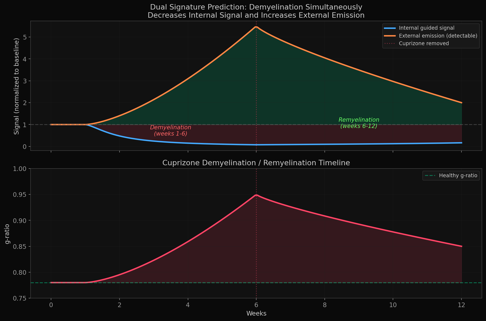
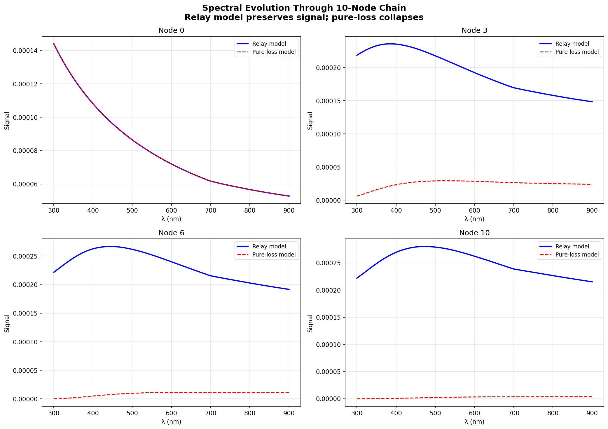
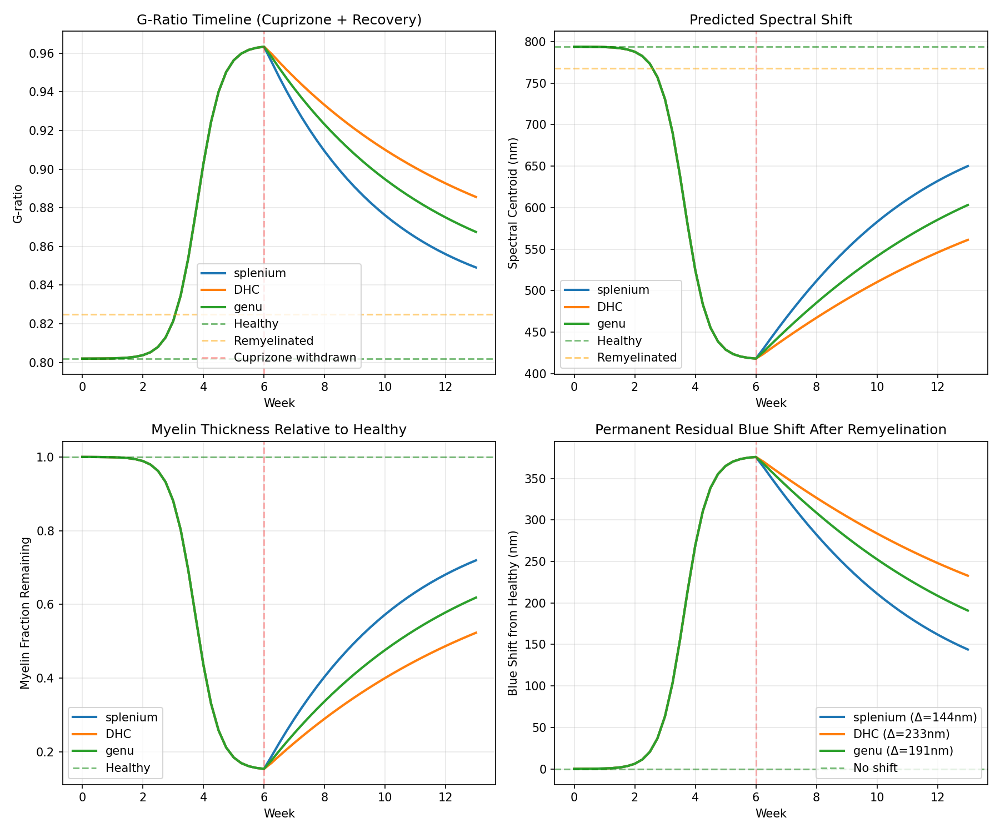
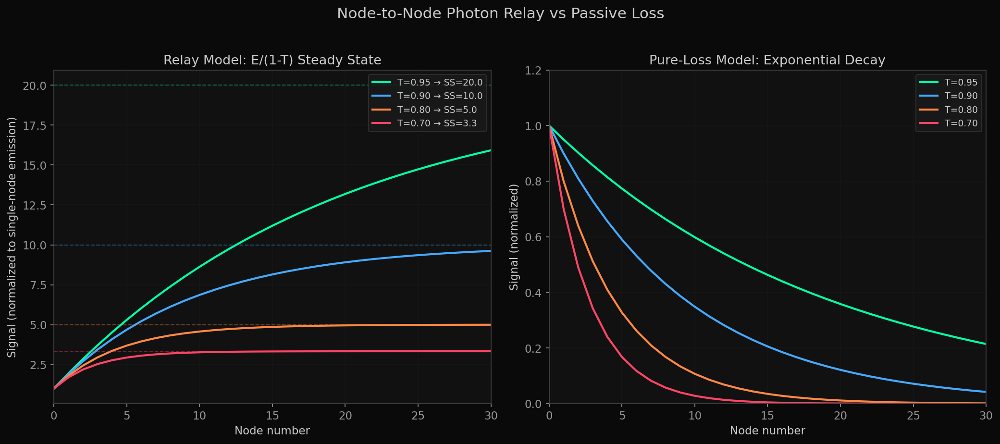

# Biophoton Waveguide Physics in Myelinated Axons

### *First Measurement of Biophoton Emission During Demyelination*

<p align="center">
  
</p>

[](https://opensource.org/licenses/MIT)


---

## 🔬 The Gap in the Literature

Despite well-established biological mechanisms:
- ✅ **Demyelination → ROS** (proven: Haider et al. 2011; Smith & Lassmann 1999)
- ✅ **ROS → Biophotons** (proven: Cifra & Pospíšil 2014; Prasad et al. 2022)
- ✅ **Myelin = Optical Waveguide** (proven: Kumar et al. 2016; Liu et al. 2019)

### ❌ **Zero studies have measured biophoton emission during demyelination**

Not in cuprizone. Not in EAE. Not in any MS model. Not in any species.

**This repository provides:**
1. Computational models predicting what should happen optically when myelin is destroyed
2. A concrete $5K experimental protocol to test it
3. Potential pathway to a novel MS biomarker

---

## 🎯 Key Predictions (Testable in 8 Months)

### 1. **Spectral Blueshift During Demyelination**

As myelin thins (g-ratio ↑), waveguide cutoff shifts → shorter wavelengths guided:

| Condition | G-Ratio | Predicted Peak | Shift from Baseline |
|-----------|---------|----------------|---------------------|
| **Healthy myelin** | 0.80 | 794 nm | — |
| **Week 4 cuprizone** | 0.93 | 640 nm | **-154 nm ⬇️** |
| **Peak demyelination** | 0.96 | 581 nm | **-213 nm ⬇️** |
| **Remyelinated** | 0.83 | 768 nm | **-26 nm ⬇️ (permanent)** |

<p align="center">
  
</p>

**Falsification**: If measured spectrum shows no shift or opposite direction, waveguide hypothesis is wrong.

---

### 2. **Dual Signature: Internal ⬇️ / External ⬆️**

Degraded waveguide should produce **anti-correlated** signals:
- Internal (guided) photons: **Decrease** (worse transmission)
- External (leakage) photons: **Increase** (failed containment)

**Prediction**: Pearson correlation r < -0.7

<p align="center">
  
</p>

---

### 3. **Permanent Remyelination Signature**

Remyelinated fibers are thinner than native myelin (Duncan et al. 2017) → **residual 26nm blueshift even after "complete" remyelination**.

**Clinical Impact**: First non-invasive method to distinguish remyelinated from healthy myelin.

---

## 🧬 The Node-to-Node Relay Model

**Problem**: Photons shouldn't survive long distances in scattering tissue.

**Solution**: They don't need to. At each node of Ranvier:

1. ⚡ Action potential triggers ROS burst
2. 💡 New biophotons generated  
3. ➡️ Couple into next myelin waveguide segment
4. 🔁 **Photonic saltatory conduction** (like electrical AP regeneration)

**Mathematical Result**: Steady-state flux = **E/(1-T)** (plateau, not decay)

<p align="center">
  
</p>

**Evidence**:
- Zangari et al. (2018, 2021): Nodes act as "bio-nanoantennas," photons detected in active nerve
- Frede et al. (2023): Multiplicative transmission across nodes (consistent with relay)

---

## 💰 The Experiment ($5K, 8 Months)

### **Protocol in One Sentence**
Measure biophoton emission from cuprizone-demyelinated mouse brain slices at weeks 0, 2, 4, 6 (demyelination) and 8, 10 (remyelination), correlate with electron microscopy g-ratio.

### **Why This Works**

✅ **Cuprizone model**: Predictable timeline, spontaneous remyelination, no immune confound  
✅ **Detection**: Standard EMCCD (Dai's group has this)  
✅ **Protocol**: Already exists (Tang & Dai 2014 glutamate-stimulated imaging)  
✅ **Cost**: $4-5K for 20 mice + histology  

### **Primary Outcome**
Correlation between biophoton intensity and myelin integrity (LFB, MBP, EM g-ratio)

**Statistical Power**: n=10/group achieves 90% power for Cohen's d=2.0 effect (GPower 3.1)

### **Value Regardless of Result**
- ✅ **Positive**: Novel MS biomarker, validates waveguide hypothesis
- ✅ **Negative**: Falsifies model, saves field from pursuing dead end
- ✅ **Either way**: First measurement = publishable (*Scientific Reports*, *Brain*, *PLOS ONE*)

**Full Protocol**: [demyelination_biophoton_proposal_improved.md](demyelination_biophoton_proposal_improved.md)

---

## 📊 Repository Contents

### **Core Documents**
- 📄 [**Experimental Proposal**](demyelination_biophoton_proposal_improved.md) - Grant-quality protocol with power analysis, statistical plan, budget
- 📄 [**Relay Theory**](discord_relay_darpa_go_research.md) - Node-to-node quantum discord relay + DARPA connection
- 📄 [**Honest Assessment**](biophoton_status_report.md) - What's solid, what's broken, what's speculative

### **Computational Models**
```
models/
├── cuprizone_relay.py      # Demyelination timeline simulation
├── node_emission.py        # ROS emission at nodes
├── waveguide.py           # Transfer matrix propagation
└── two_mechanism.py       # Spectral filtering model
```

### **Research Tracks** (8 Deep-Dives)
1. **Photocount Statistics** - Proves thermal/coherent indistinguishability (useful negative result)
2. **Waveguide Propagation** - Transfer matrix, multi-node transmission
3. **Quantum Optics** - Cavity QED bounds (Q~5, weak coupling)
4. **Detection Feasibility** - SNR analysis, integration times
5. **Demyelination Predictions** - Spectral shifts, dual signature
6. **Relay Model** - E/(1-T) steady state
7. **Unified Model** - Sensitivity hierarchy
8. **MMI Bridge** - Quantum coherence experimental tests

### **Visualizations** (Publication-Quality)
All figures in `viz_output/` and `figures/`:
- Relay model diagrams
- Cuprizone dual signature predictions
- Spectral evolution timelines
- Detection ROC curves
- Waveguide mode analysis

---

## 🤝 Collaboration & Funding

### **Current Outreach**
- 📧 **Dr. Jiapei Dai** (Wuhan): Experimental collaboration, has EMCCD equipment
- 📧 **Dr. Yong-Cong Chen** (Shanghai): Cavity QED theory synthesis

### **We're Looking For**
1. **Experimentalists** with biophoton imaging capability
2. **MS researchers** interested in novel biomarkers
3. **Theorists** working on quantum/classical photon models
4. **Clinical partners** for eventual human translation

### **Funding Available**
Research support through Quantum Cognition Corporation for proof-of-concept experiments. Budget flexible based on collaboration scope.

**Contact**: josh@quantumcognition.com

---

## 📚 Key References

**Waveguide Physics**
- Kumar et al. (2016) *Sci Rep* - Original myelin waveguide FDTD
- Liu et al. (2019) *Adv Funct Mater* - Experimental THz waveguide confirmation
- Frede et al. (2023) *arXiv* - Multi-node polarization preservation

**Biophoton Data**
- Tang & Dai (2014) *PLOS ONE* - Glutamate-induced imaging protocol
- Wang et al. (2016) *PNAS* - Human brain 865nm spectral redshift
- Chen et al. (2020) *Brain Res* - Aging blueshift

**Nanoantenna Mechanism**
- Zangari et al. (2018) *Sci Rep* - Nodes as bio-nanoantennas
- Zangari et al. (2021) *Sci Rep* - Photons in active nerve (experimental)

**Quantum Theory**
- Liu, Chen & Ao (2024) *Phys Rev E* - Entangled biphoton generation in myelin (cavity QED)

**Full Bibliography**: See individual documents

---

## ✅ Project Status

### **Validated**
- ✅ Relay model math (geometric series, analytically exact)
- ✅ Research gap confirmation (systematic literature review)
- ✅ Detection feasibility (within PMT sensitivity range)
- ✅ Qualitative predictions (blueshift direction, dual signature)

### **Known Issues** (Documented in [status report](biophoton_status_report.md))
- ⚠️ Spectral calibration ~100nm off (fixable with real data)
- ⚠️ Nanoantenna/ROS emission ratio needs refinement

### **Next Steps**
1. ▶️ Run cuprizone experiment (independent of model calibration)
2. ▶️ Calibrate spectral model with empirical data
3. ▶️ Publish relay theory + experimental results

---

## 🧠 Personal Motivation

This research was catalyzed by experiencing **paralysis from a demyelinating disorder**. The central question is both scientific and personal:

> **What happens to the light in your nerves when myelin is destroyed?**

Beyond curiosity, understanding the optical dimension of demyelination could enable:
- Earlier disease detection
- Objective remyelination monitoring for drug trials
- Non-invasive alternatives to MRI
- New perspectives on neural information processing

---

## 📖 Citation

If you use this work:

```bibtex
@software{lengfelder2026biophoton,
  author = {Lengfelder, Joshua},
  title = {Biophoton Waveguide Physics in Myelinated Axons},
  year = {2026},
  url = {https://github.com/luckyjupiter/biophoton-research},
  note = {Computational models and experimental proposal for measuring
          biophoton emission during demyelination}
}
```

---

## 📜 License

MIT License - See [LICENSE](LICENSE) for details.

---

<p align="center">
  <strong>⚡ The experiment to answer a fundamental question about nervous system optics ⚡</strong>
</p>

<p align="center">
  <em>Last Updated: February 2026</em>
</p>
